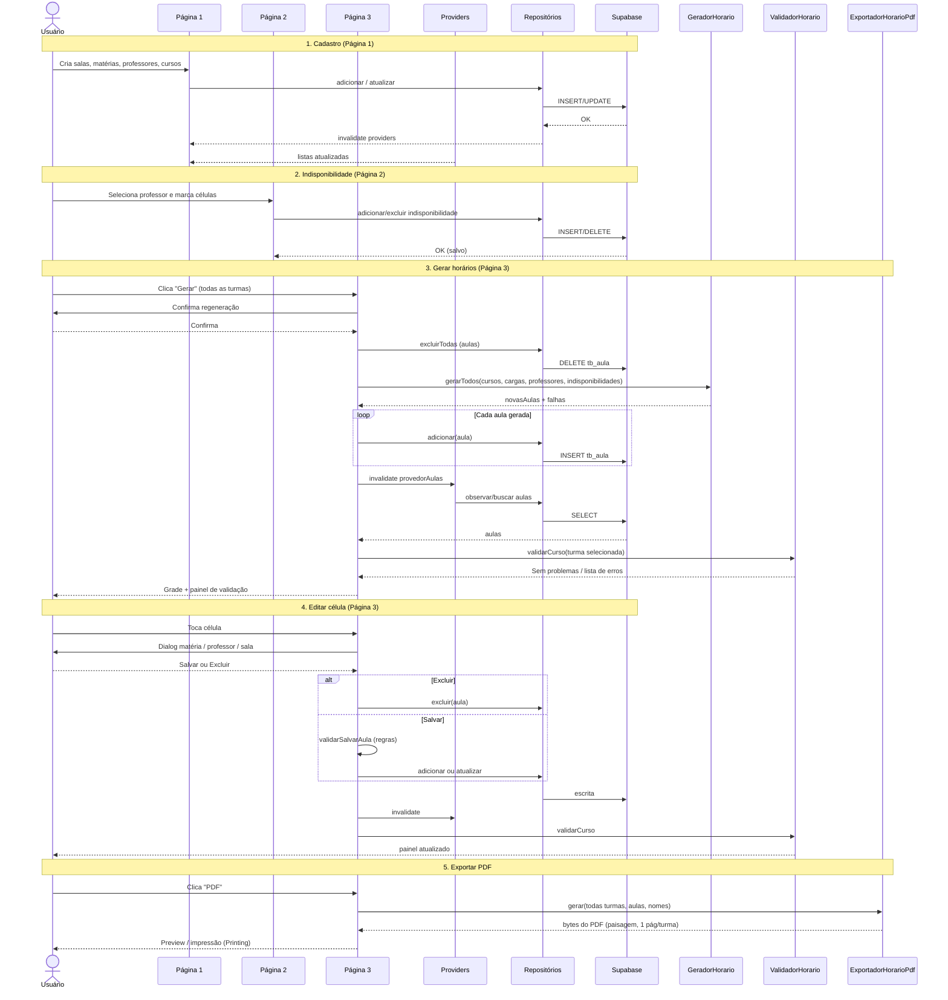
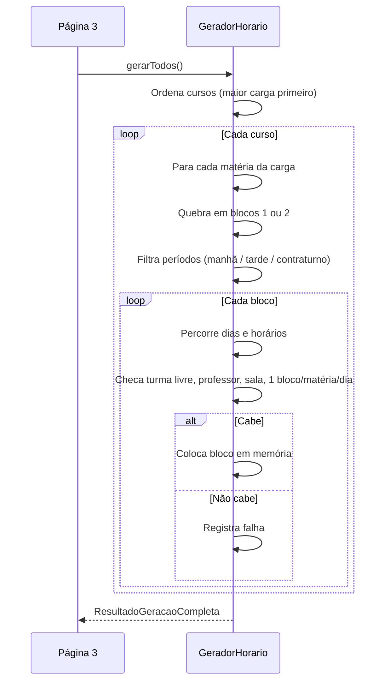
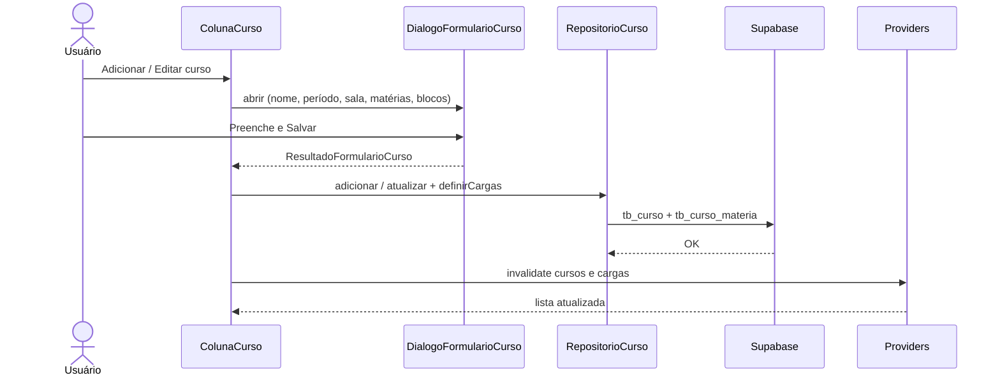

# Diagramas de sequência — Timetable

App Flutter + Riverpod + Supabase para montagem de horários escolares.

---

## 1. Visão geral dos fluxos

---

## 2. Detalhe — Gerador de horário

---

## 3. Detalhe — Cadastro de curso (Página 1)

---

## 4. Participantes (resumo)

| Participante | Papel |
|--------------|--------|
| Página 1 | CRUD de salas, matérias, professores e cursos |
| Página 2 | Indisponibilidade de professores na grade |
| Página 3 | Visualizar, gerar, editar aulas e exportar PDF |
| Providers | Riverpod — streams e repositórios |
| Repositórios | Acesso REST/Realtime ao Supabase |
| GeradorHorario | Aloca blocos respeitando regras |
| ValidadorHorario | Avisos na faixa abaixo da grade |
| ExportadorHorarioPdf | PDF paisagem, uma página por turma |

---

## Como visualizar

- **GitHub / GitLab:** o Mermaid renderiza no próprio `.md`
- **VS Code / Cursor:** extensão “Markdown Preview Mermaid Support” ou preview nativo
- **Online:** [mermaid.live](https://mermaid.live) — cole os blocos `mermaid`
